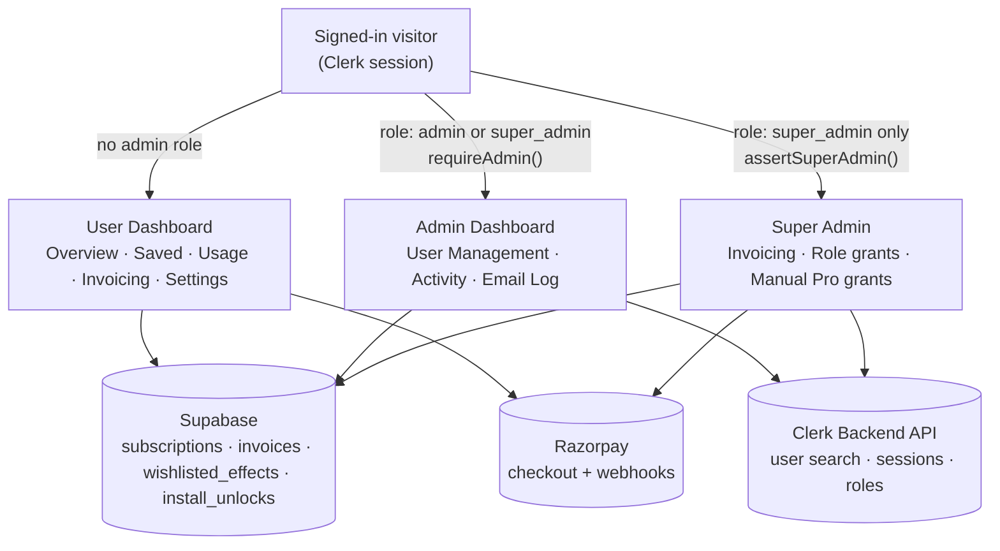

# Vault Control Plane - Dashboard Audit

**Scope:** `/dashboard/*`, `/dashboard/admin/*`, and their API routes, as of 2026-09-10.
**Method:** grounded in the actual route/schema behavior exercised while diagnosing and fixing
the invoicing and user-search bugs referenced below - not a surface read of the UI alone.

## Summary

Underneath the dashboards, Vault's data is in better shape than the UI on top of it lets on.
Every install, copy, save, and payment is already logged somewhere real - `install_unlocks`,
`wishlisted_effects`, `invoices`, `sent_emails`. The gap isn't missing data; it's that the
admin surface built on top of it had a handful of real correctness bugs (several fixed this
cycle - a user directory that silently stopped existing past ~100 people, an invoice-recording
path that had been failing on every real purchase, undetected) and is missing a short list of
things a senior engineer would consider non-negotiable for actually running a product: an audit
trail, a way to reconcile a confused customer's account in one place, and a way to see
admin/support state without touching a database console directly.

None of that is a redesign. It's the difference between a dashboard that *displays* the
product and one that lets a human *operate* it.

| | |
|---|---|
| Surfaces reviewed | 11, across 3 access tiers |
| Correctness bugs found & fixed this cycle | 5 |
| Baseline admin primitives missing outright | 5 of 12 |
| Audit trail entries for any admin action, ever | 0 |

## The flow behind it

One identity provider, three access tiers gated server-side, three backing systems. Nothing
about role visibility is decided in the browser - every admin/super-admin API route
independently re-checks the caller's role.

Role is read from `publicMetadata.role` and checked on every admin/super-admin API route
independently of the page - a regular admin literally cannot fetch super-admin-only fields by
guessing a URL. That's the right shape; see [What's already right](#whats-already-right).

## Tier 1 - User dashboard

Five pages a paying or free customer sees. Job: show them what they have, what they've done,
and let them manage their own account without a support ticket.

| Page | Job | Status | Note |
|---|---|---|---|
| Overview | Plan, validity, CLI token, upgrade path | **Solid** | Clear at-a-glance stat cards; "Manage Subscription" correctly hands off to Razorpay's own portal rather than reimplementing billing UI. |
| Saved Effects | Wishlist browsing | **Solid** | Category filtering, sensible empty states for "no saves" vs. "no saves in this filter." |
| Usage | Daily copy quota + history | **Solid** | Date range, source (web/CLI/MCP), and category filters on one page - more filtering depth than most of the admin tables had until this cycle. |
| Invoicing | Billing history, receipts | **Fixed this cycle** | Real purchases were landing here silently empty - `recordInvoice()` had been failing since it was introduced, on a missing unique constraint nobody had hit before. See [Super admin](#tier-3--super-admin). |
| Settings | Profile, avatar, password/OTP reset | **Solid** | Password reset has a proper forgot-password OTP branch, not just "email support." |
| CLI Token Manager *(on Overview)* | Generate/revoke the CLI & MCP identity token | **Gap** | Never fetches or shows whether a token currently exists, when it was created, or when it was last used - Revoke is always clickable even with nothing to revoke. The admin side already tracks `cli_token_created_at` / `cli_token_last_used_at`; it's just never shown back to the person who owns the token. |

## Tier 2 - Admin dashboard

Where an admin finds a user, sees what the site is doing in aggregate, and checks whether an
email actually sent.

| Page | Job | Status | Note |
|---|---|---|---|
| User Management | Directory, search, plan/role control | **Fixed this cycle** | Was hard-bound to roughly the 100 most-recently-joined users for both browsing and search - anyone outside that window returned "no results," indistinguishable from not existing. Rebuilt on Clerk's own full-userbase search plus real server pagination. |
| Activity → Overview | Site-wide 30-day trends, per-user drill-in | **Solid** | Signups, copies, revenue, plan mix, top saved/copied effects in one screen. |
| Activity → Installs & Copies | CLI/MCP/web delivery ledger | **Solid** | Genuinely good instinct: tracks a "would-be-denied rate" in shadow mode before ever switching real enforcement on - see [What's already right](#whats-already-right). |
| Activity → per-user detail | One user's full picture | **Thin** | Sessions, saves, copies, and billing history in one place - but the billing rows here have no link out to the actual Razorpay invoice. Have to cross-reference the separate Super Admin Invoicing tab by hand. |
| Email Log | Delivery log, HTML preview, click tracking | **Thin** | No search by recipient. "Did this one person actually get their invite" means paging through the whole log by eye. |

## Tier 3 - Super admin

Money and access. Everything here can move real revenue numbers or hand out real power, which
is exactly why it's the smallest, most gated surface of the three.

| Page | Job | Status | Note |
|---|---|---|---|
| Invoicing | Every real + test invoice, revenue totals | **Fixed this cycle** | The upstream write path (`recordInvoice`) had been silently failing since launch - the source of truth this page reads from wasn't trustworthy until the missing constraint was found and fixed. This page was reporting real revenue correctly only by accident. |
| Manual Pro grant *(Manage modal)* | Comp Pro access with no real payment | **Needs a home** | A flag to mark a comped grant as "demo account, not a paying customer" (vs. a real Razorpay subscription) was built and then rolled back pending a schema migration on your end. The need is real - `countPaidUsers()` already quietly relies on `razorpay_subscription_id` being null to exclude comped accounts from the paying-customer count, so the distinction already exists in the data; it just isn't labeled anywhere a human can see it. |
| Role grants | Elevate/demote admin access | **Solid** | Self-lockout is guarded server-side, not just hidden in the UI - a super admin genuinely cannot strip their own role via this endpoint. |

## What's already right

Worth naming explicitly so none of it gets refactored away by accident.

- **Role checks live server-side, per route** - not just a hidden button. Every admin API
  independently re-checks `getRole()`/`isSuperAdminUser()`, so there's no "inspect element, see
  the Manage button" path to power that isn't actually gated.
- **A super admin can't demote themselves.** The role-update endpoint rejects a request where
  the target is the caller - the one guard against a whole class of "oops, now nobody has
  access" incidents.
- **Founding-slot claims use a real Postgres advisory lock**, not an application-level
  check-then-write. Correct under concurrent signups, not just "probably fine under load."
- **The invite quota shows a live "X of 100 left today,"** computed from the same table the cap
  enforces against - never a number that can drift from reality.
- **Install limits were shadow-mode instrumented before enforcement went live** - a
  "would-be-denied rate" was tracked and reviewed first, rather than flipping a limit on and
  finding out who it breaks from support tickets.
- **The Manage modal's plan/role changes require an explicit review step** that names exactly
  what's about to change before it fires. Right shape - just not yet the house style everywhere
  a mutation happens.

## The baseline - what a senior engineer ships

Not a wishlist - the list of things that stop being optional once real customers' money and
data are involved. Twelve primitives, checked against what actually exists today.

| Primitive | Why it's non-negotiable | Status |
|---|---|---|
| Server-enforced RBAC | A hidden button is not access control. | ✅ Have |
| Full-userbase search | "Find this one person" is the single most common admin action there is. | ✅ Have (fixed) |
| Accurate server-side pagination | A count that's wrong past page one erodes trust in every other number on the page. | ✅ Have (fixed) |
| Bulk data export | Finance, legal, and migrations all eventually ask for "just give me the CSV." | ✅ Have |
| Audit log of admin actions | "Who upgraded this account, and when" needs an answer that isn't a Slack search. | ❌ Missing |
| Impersonation / "view as user" | Half of support debugging is "what is this person actually seeing." | ❌ Missing |
| System health surface | Webhook silently stopping, email bounce spike - these need a dashboard, not a bug report from a customer. | ⚠️ Partial (Email Log only) |
| Billing reconciliation view | One screen to answer "did this specific payment actually create this specific invoice." | ⚠️ Partial (exists, was unreliable) |
| Entitlement overrides with provenance | Comped access must be visibly distinct from a paying customer everywhere revenue gets counted. | ⚠️ Open (built, rolled back) |
| Confirm + reversibility on destructive actions | Revoking Pro or granting Super Admin should never be one accidental click. | ⚠️ Partial (one surface only) |
| Deep-linkable filter state | "Here's the exact view I'm looking at" should be a URL you can paste to a teammate. | ❌ Missing |
| Saved views / alerting on metrics | Nobody should have to remember to check if failed-email rate spiked. | ❌ Missing |

## Does it actually work day to day?

Six scenarios a real admin runs into.

| Who | Scenario | Status |
|---|---|---|
| Marketing | "How many people signed up and converted to Pro this week?" | ✅ **Works** - Activity Overview's trend charts, or the new User Management activity tiles switched to "Last 7 days." |
| Support | "A customer says they paid but don't have Pro." | ⚠️ **Friction** - doable, but four manual steps: find the user, open their activity detail, cross-check the separate Invoicing tab, then verify against Razorpay directly. Exactly the walk this session took to diagnose one real case. |
| Trust & safety | "Who currently has admin or super-admin access?" | ⚠️ **Friction** - no filter for it; means scrolling the entire user directory hunting for role badges. |
| Ops | "Did someone just accidentally downgrade a paying customer?" | ❌ **Blocked** - no way to answer this at all; plan changes leave no record of who made them. |
| Support | "Show me exactly what this confused user is seeing right now." | ❌ **Blocked** - no impersonation / view-as. Reproducing their state means asking them to screen-share. |
| Ops | "Is the Razorpay webhook still actually firing?" | ❌ **Blocked** - no ongoing monitor; one real instance of it silently failing (invoice recording) was only caught this session by deliberately going looking. |

## Recommendations

Grouped by how soon it stops being optional - not a sprint plan, just the order the gaps above
start to hurt.

### Now - revenue & trust

- **Admin action audit log.** One table: who, what changed, on which account, when. Every
  mutation route already knows this - just needs one insert.
- **Finish the comped-vs-paid flag.** Run the pending migration, re-land the reverted feature.
  Revenue reporting is quietly wrong without it the moment demo accounts exist.
- **Link billing views together.** Per-user detail ↔ Super Admin Invoicing should cross-link
  both directions - five-minute change, closes a real daily friction point.

### Next - support leverage

- **Recipient search on the Email Log.** "Did this person get their email" shouldn't require
  paging by eye.
- **An "Admins" filter on User Management.** Trust & safety shouldn't scroll the whole
  directory to answer "who has the keys."
- **Surface CLI token status to its owner.** The data already exists server-side - just render
  it back on the page that owns the Revoke button.

### Later - operational maturity

- **Read-only impersonation / view-as.** Biggest single support-time saver on this list; also
  the most sensitive to get right (audit-logged, time-boxed, clearly bannered).
- **A real health surface.** Webhook last-seen timestamp, email bounce rate trend, a page whose
  only job is "is anything quietly broken right now."
- **Deep-linkable filters + saved views.** Turns "let me re-explain what I was looking at" into
  a pasted link.
